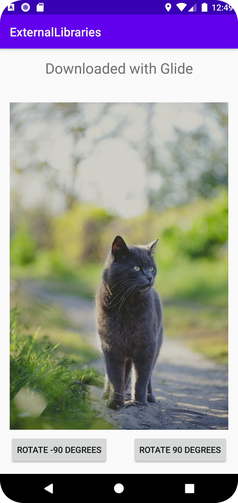

# Rapport

Forked the project external-libraries and looked for external libraries.
Found an interesting external library about image loader and added into the build.gradle and sync the build.gradle file.
With glide I downloaded a picture from an URL and insert into an ImageView.
Glide is an easy to use external library and due to it being so simple I added two buttons to rotate the image by -90 and +90 degrees.


```Java

   // Using Glide as external libraries and added into the build.gradle
   implementation 'com.github.bumptech.glide:glide:4.11.0'
   annotationProcessor 'com.github.bumptech.glide:compiler:4.11.0'

  // Used Glide to download a picture from internet
  Glide.with(this).load("https://cdn.pixabay.com/photo/2022/05/08/18/13/cat-7182671_960_720.jpg").into(imageOne);

   // Left button to rotate the image by 90 degrees. Right button is almost the same but with angle -= 90.
   leftButton.setOnClickListener(new View.OnClickListener() {
        @Override
        public void onClick(View view) {
            //Rotates the image with 90 degrees
            angle += 90;
            imageOne.setRotation(angle);
        }
    });


```


